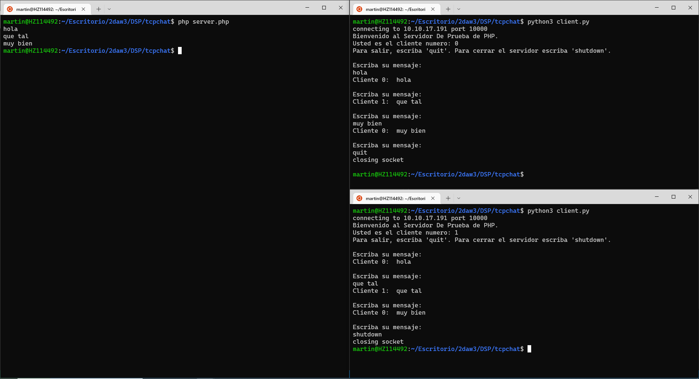

### Martin Fagoaga

# CHAT TCP

Nuestro servidor está programado en php, y tiene la posibilidad de multiples conexiones. Los mensajes recibidos los difunde a todos los clientes conectados. 

El cliente está programado en python, ya que es un lenguaje muy sencillo para implementar el multihilo, permitiendo escuchar mensajes y enviarlos simultaneamente. 

Imagen 1: Funcionamiento del servidor TCP  

Imagen 2: Cerrando la conexión

Imagen 3: Apagando el servidor 

# CHAT UDP

El servidor está programado esta vez en python, igual que el cliente. El servidor utiliza un diccionario para guardar las direcciones que hayan enviado un mensaje previamente, y a todas estas direcciones envía los mensajes recibidos. El cliente envía mensajes a todos los servidores en la subred que utilicen el puerto 3000.

Imagen 4: Funcionamiento del servidor y clientes UDP

